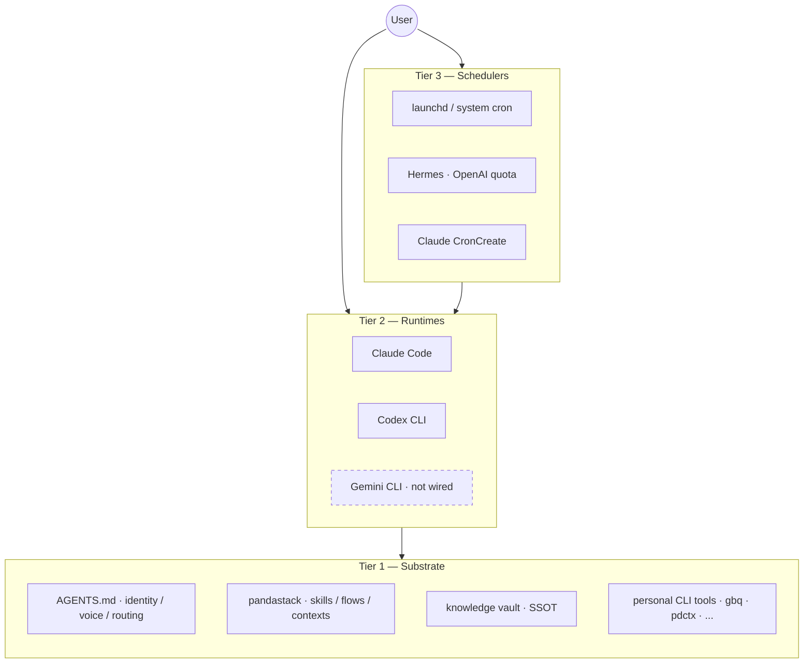

# pandastack

Personal context-aware AI operator OS — declare contexts once, AI runtimes follow.

## What is pandastack

The **Tier 1 substrate** is runtime-agnostic: identity, voice, skill content, knowledge vault, and personal CLI tools live on disk. All runtimes read the same `AGENTS.md` before acting. No vendor lock-in at the data layer.

The **Tier 2 runtimes** (Claude Code, Codex CLI, Gemini CLI) are thin consumers of Tier 1. Each gets a slim shim in its dotdir (`~/.claude/`, `~/.codex/`, `~/.gemini/`). Skills, flows, and context recipes are identical across runtimes; a per-CLI tool-name mapping handles syntax differences.

The **Tier 3 schedulers** (launchd, Hermes, Claude CronCreate) orchestrate Tier 2. Hermes spawns Codex on OpenAI quota for overnight cron jobs, preserving Claude token budget for foreground work. All three layers share the same Tier 1 substrate — no duplication, no drift.



## Status

v1.0.0 stable. Dogfooded by 1 user since 2026-04-29. API and schema are stable from this version forward.

## What's in it

- **39 skills** across dev, knowledge, writing, work, research, retro, and decision lifecycles
- **8 context recipes** (4 public + 4 work contexts via private overlay)
- **5 personas**: eng, design, ceo, ops, product
- **7 lifecycle flows**: dev, knowledge, writing, work, research, retro, decision

## Install

pandastack is a Claude Code plugin. Install via the built-in plugin marketplace:

```
/plugin marketplace add panda850819/pandastack
/plugin install pandastack@pandastack
/reload-plugins
```

For local development (cloned repo):

```
/plugin marketplace add ~/path/to/pandastack
/plugin install pandastack@pandastack
/reload-plugins
```

Run `/pandastack:init` once in your project after install.

**pdctx CLI** (context switching, firewall, cron dispatch — separate repo):

```bash
git clone https://github.com/panda850819/pdctx ~/path/to/pdctx
cd ~/path/to/pdctx && bun install && bun link
pdctx init
pdctx use personal:developer
```

**Codex CLI**: see [`plugins/pandastack/.codex/INSTALL.md`](plugins/pandastack/.codex/INSTALL.md).

## Quickstart

| Command | Outcome |
|---|---|
| `pdctx status` | Shows active context, recent calls, in-flight dispatches |
| `pdctx use personal:writer` | Switches to writer context; injects persona + skill subset |
| `pdctx call personal:developer "summarize today's note"` | Dispatches subagent with full context injected |
| `gbq "<question>"` | Vault hybrid search (requires gbrain) |
| `/morning-briefing` | Invokes the morning briefing skill manually |

## Contexts

Context recipes live in `plugins/pandastack/contexts/*.toml`. Each recipe binds a flow, persona, skill subset, memory namespace, and gbrain source list to a specific identity.

| Context | Purpose |
|---|---|
| `personal:developer` | Personal dev work — eng persona, dev + knowledge flows |
| `personal:writer` | Personal writing — writing + knowledge flows |
| `personal:knowledge-manager` | Vault maintenance, wiki lint, knowledge lifecycle |
| `personal:trader` | Market research, on-chain analysis, trading flows |
| *(4 work contexts)* | Org-specific roles — defined in a private overlay |

## Personas

5 replaceable personas in `plugins/pandastack/agents/`:

| Persona | Role |
|---|---|
| `eng` | Staff engineer — build, review, debug, ship |
| `design` | Senior designer — UI/UX, accessibility, anti-slop |
| `ceo` | Strategic advisor — scope decisions, kill/pivot |
| `ops` | COO — systems that run without you, process design |
| `product` | VP Product — requirements, scope, metrics |

Replace any persona file; all skills that reference it pick up the change after `/reload-plugins`.

## Lifecycle Flows

7 flow specs in `plugins/pandastack/flows/`:

| Flow | Lifecycle |
|---|---|
| `dev` | brief → build → review → qa → ship → extract |
| `knowledge` | capture → distill → verify → ship → lint |
| `writing` | capture → structure → draft → ship → distribute |
| `work` | triage → context → execute → ship → push (vault-only) |
| `research` | scope → fetch → dive → distill → ship |
| `retro` | daily / weekly / monthly cadence with auto-scan |
| `decision` | cron-driven decision triage |

## Telemetry opt-out

pandastack appends one JSON event per action to a daily JSONL timeline:

```
~/.pdctx/audit/timeline-YYYY-MM-DD.jsonl
```

Events: `session_start`, `skill_invoke`, `tool_use`, `firewall_decision`, `session_end`. No prompt content, tool arguments, or file contents are logged.

```bash
export PDCTX_TIMELINE_DISABLED=1   # disable the timeline entirely
export PDCTX_L5_DISABLED=1         # disable L5 firewall only (timeline stays on)
```

See [`docs/telemetry.md`](docs/telemetry.md) for the schema and sample analysis queries.

## Layer model (firewall)

Five active layers between context declaration and tool execution:

| Layer | Mechanism |
|---|---|
| L1 | Prompt-level persona / voice / banned phrases |
| L2 | Filesystem chmod on memory namespace per context |
| L3 | MCP deny list enforced at PreToolUse |
| L4 | Context recipe loaded via `pdctx use` |
| L5 | Per-skill allowlist on tool args and file paths |

L5 reads `reads`, `writes`, `forbids`, and `classification` from each SKILL.md's frontmatter. Skills without frontmatter metadata are treated as permissive with a warning. See [`docs/firewall-l5.md`](docs/firewall-l5.md) for the decision tree, sample deny output, and known gaps.

## Multi-runtime arbitrage

Claude Code (Opus) handles foreground reasoning where depth matters. Codex CLI takes multi-file edits and batch tasks via `pdctx call`, spending OpenAI subscription quota instead of Claude tokens. Hermes schedules overnight Codex jobs against the same Tier 1 substrate. Gemini CLI is in Tier 2 but not yet wired; the planned use case is long-document distill passes requiring 1M-token context.

## Hermes jobs (current)

| Job | Schedule | Skill |
|---|---|---|
| Morning Briefing | `0 8 * * *` (daily 8 AM) | `/morning-briefing` |
| Evening Distill | `0 22 * * *` (daily 10 PM) | `/evening-distill` |
| Weekly Retro Prep | `0 9 * * 5` (Fri 9 AM) | `/weekly-retro-prep` |

## Contributing

Skills go in `plugins/pandastack/skills/<name>/SKILL.md`. Keep each skill under 80 lines. Run `pdctx skill-validate` before opening a PR. Frontmatter fields `reads`, `writes`, `forbids`, `domain`, and `classification` are optional but recommended for L5 coverage. See [SKILL-FRONTMATTER.md](SKILL-FRONTMATTER.md) for the schema.

## License

MIT

## Acknowledgements

Inspired by gstack's JSONL session timeline; iterated upon for context isolation.
