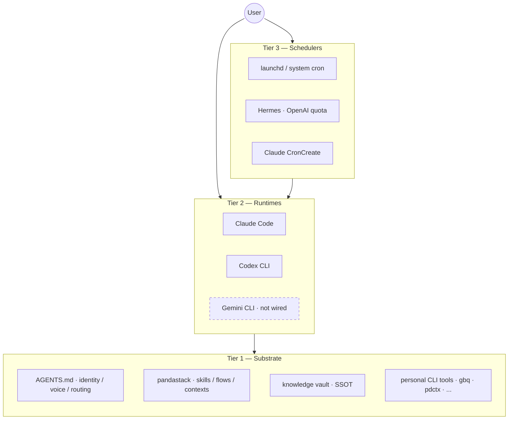

# pandastack

Personal context-aware AI operator OS — declare contexts once, AI runtimes follow.

## What is pandastack

The **Tier 1 substrate** is runtime-agnostic: identity, voice, skill content, knowledge vault, and personal CLI tools live on disk. All runtimes read the same `AGENTS.md` before acting. No vendor lock-in at the data layer.

The **Tier 2 runtimes** (Claude Code, Codex CLI, Gemini CLI) are thin consumers of Tier 1. Each gets a slim shim in its dotdir (`~/.claude/`, `~/.codex/`, `~/.gemini/`). Skills, flows, and context recipes are identical across runtimes; a per-CLI tool-name mapping handles syntax differences.

The **Tier 3 schedulers** (launchd, Hermes, Claude CronCreate) orchestrate Tier 2. Hermes spawns Codex on OpenAI quota for overnight cron jobs, preserving Claude token budget for foreground work. All three layers share the same Tier 1 substrate — no duplication, no drift.



## Status

v1.0.0 stable. Dogfooded by 1 user since 2026-04-29. API and schema are stable from this version forward.

## What's in it

- **39 skills** across dev, knowledge, writing, work, research, retro, and decision lifecycles
- **8 context recipes** (4 public + 4 work contexts via private overlay)
- **5 personas**: eng, design, ceo, ops, product
- **7 lifecycle flows**: dev, knowledge, writing, work, research, retro, decision

## Runtime support

pandastack is not a monolithic runtime. It is a stack package: shared skills, flows, personas, context recipes, and conventions that different hosts can consume.

Host design notes live in [`docs/ADDING_A_HOST.md`](docs/ADDING_A_HOST.md).

| Host | Status | Install model |
|---|---|---|
| Claude Code | First-class | Claude plugin marketplace, local repo or GitHub repo |
| Codex CLI | Supported | Native skill discovery via clone + symlink |
| Hermes | Supported as scheduler / host, not as first-class packaged runtime yet | Use `pdctx` for context dispatch, or import/symlink selected skills into `~/.hermes/skills/` |
| OpenClaw | Planned / experimental | Intended shape is a skill package, not shipped as a first-class installer in this repo yet |

## Install

### 1. Claude Code, recommended path

Install from GitHub marketplace source:

```
/plugin marketplace add panda850819/pandastack
/plugin install pandastack@pandastack
/reload-plugins
```

Install from a local cloned repo, useful for dogfood and author testing:

```
/plugin marketplace add /absolute/path/to/pandastack
/plugin install pandastack@pandastack
/reload-plugins
```

After install, run `/pandastack:init` once inside your project.

### 2. Codex CLI

Codex consumes pandastack through native skill discovery, not the Claude plugin manifest.

See [`plugins/pandastack/.codex/INSTALL.md`](plugins/pandastack/.codex/INSTALL.md) for the full clone + symlink flow.

Minimal path:

```bash
git clone https://github.com/panda850819/pandastack.git ~/.codex/pandastack
ln -s ~/.codex/pandastack/plugins/pandastack/skills ~/.codex/skills/pandastack
```

Then restart Codex.

### 3. Hermes

Hermes does not consume the Claude plugin manifest directly. Today there are two valid ways to use pandastack with Hermes.
Detailed guide: [`docs/HERMES.md`](docs/HERMES.md)

#### Option A, recommended: Hermes as scheduler / host, `pdctx` as dispatch layer

This is the setup used in dogfood. Hermes cron or chat triggers a `pdctx call ...`, and `pdctx` injects the right context, persona, and skill subset into the downstream runtime.

```bash
git clone https://github.com/panda850819/pdctx ~/site/cli/pdctx
cd ~/site/cli/pdctx
bun install
bun link
pdctx init
pdctx use personal:developer
```

Example dispatch:

```bash
pdctx call personal:writer "/brief-morning"
```

#### Option B, direct Hermes skill import

If you want Hermes to load the skills directly, symlink or copy selected skill folders from `plugins/pandastack/skills/` into `~/.hermes/skills/` under your preferred category layout.

This repo does not currently ship a first-class Hermes package manifest. The content is portable, but packaging is still manual.

### 4. OpenClaw

OpenClaw support is not shipped here as a first-class installer yet.
Detailed guide: [`docs/OPENCLAW.md`](docs/OPENCLAW.md)

Current intended direction:
- pandastack content stays host-agnostic
- OpenClaw should consume it as a skill package, not via the Claude plugin manifest
- host-specific glue, naming, and runtime contracts should live on the OpenClaw side

If you want to experiment today, use `plugins/pandastack/skills/` as the source of truth and adapt the host-side manifest / loader in your OpenClaw environment. Treat this as experimental, not stable install surface.

## Quickstart

| Command | Outcome |
|---|---|
| `pdctx status` | Shows active context, recent calls, in-flight dispatches |
| `pdctx use personal:writer` | Switches to writer context; injects persona + skill subset |
| `pdctx call personal:developer "summarize today's note"` | Dispatches subagent with full context injected |
| `gbq "<question>"` | Vault hybrid search (requires gbrain) |
| `/brief-morning` | Invokes the morning briefing skill manually (alias `/morning-briefing` valid until 2026-08-04) |

## Local development loop, author workflow

If you are developing pandastack itself, the clean loop is:

1. Clone the repo locally.
2. Point Claude Code marketplace at that local repo.
3. Install `pandastack@pandastack` from the local source.
4. Edit files in the repo.
5. Run `/reload-plugins` in Claude Code to pick up changes.
6. Re-run the target skill / flow.

Example:

```
/plugin marketplace add /absolute/path/to/pandastack
/plugin install pandastack@pandastack
/reload-plugins
```

For Codex, the equivalent loop is `git pull` or local edits on the cloned repo plus a Codex restart. For Hermes direct-import setups, re-copy or re-symlink the changed skill files.

## Contexts

Context recipes live in `plugins/pandastack/contexts/*.toml`. Each recipe binds a flow, persona, skill subset, memory namespace, and gbrain source list to a specific identity.

| Context | Purpose |
|---|---|
| `personal:developer` | Personal dev work — eng persona, dev + knowledge flows |
| `personal:writer` | Personal writing — writing + knowledge flows |
| `personal:knowledge-manager` | Vault maintenance, wiki lint, knowledge lifecycle |
| `personal:trader` | Market research, on-chain analysis, trading flows |
| *(4 work contexts)* | Org-specific roles — defined in a private overlay |

## Personas

5 replaceable personas in `plugins/pandastack/agents/`:

| Persona | Role |
|---|---|
| `eng` | Staff engineer — build, review, debug, ship |
| `design` | Senior designer — UI/UX, accessibility, anti-slop |
| `ceo` | Strategic advisor — scope decisions, kill/pivot |
| `ops` | COO — systems that run without you, process design |
| `product` | VP Product — requirements, scope, metrics |

Replace any persona file; all skills that reference it pick up the change after `/reload-plugins`.

## Lifecycle Flows

7 flow specs in `plugins/pandastack/flows/`:

| Flow | Lifecycle |
|---|---|
| `dev` | brief → build → review → qa → ship → extract |
| `knowledge` | capture → distill → verify → ship → lint |
| `writing` | capture → structure → draft → ship → distribute |
| `work` | triage → context → execute → ship → push (vault-only) |
| `research` | scope → fetch → dive → distill → ship |
| `retro` | daily / weekly / monthly cadence with auto-scan |
| `decision` | cron-driven decision triage |

## Telemetry opt-out

pandastack appends one JSON event per action to a daily JSONL timeline:

```
~/.pdctx/audit/timeline-YYYY-MM-DD.jsonl
```

Events: `session_start`, `skill_invoke`, `tool_use`, `firewall_decision`, `session_end`. No prompt content, tool arguments, or file contents are logged.

```bash
export PDCTX_TIMELINE_DISABLED=1   # disable the timeline entirely
export PDCTX_L5_DISABLED=1         # disable L5 firewall only (timeline stays on)
```

See [`docs/telemetry.md`](docs/telemetry.md) for the schema and sample analysis queries.

## Layer model (firewall)

Five active layers between context declaration and tool execution:

| Layer | Mechanism |
|---|---|
| L1 | Prompt-level persona / voice / banned phrases |
| L2 | Filesystem chmod on memory namespace per context |
| L3 | MCP deny list enforced at PreToolUse |
| L4 | Context recipe loaded via `pdctx use` |
| L5 | Per-skill allowlist on tool args and file paths |

L5 reads `reads`, `writes`, `forbids`, and `classification` from each SKILL.md's frontmatter. Skills without frontmatter metadata are treated as permissive with a warning. See [`docs/firewall-l5.md`](docs/firewall-l5.md) for the decision tree, sample deny output, and known gaps.

## Multi-runtime arbitrage

Claude Code (Opus) handles foreground reasoning where depth matters. Codex CLI takes multi-file edits and batch tasks via `pdctx call`, spending OpenAI subscription quota instead of Claude tokens. Hermes schedules overnight Codex jobs against the same Tier 1 substrate. Gemini CLI is in Tier 2 but not yet wired; the planned use case is long-document distill passes requiring 1M-token context.

## Hermes jobs (current)

| Job | Schedule | Skill |
|---|---|---|
| Morning Briefing | `0 8 * * *` (daily 8 AM) | `/brief-morning` (was: `/morning-briefing`) |
| Evening Distill | `0 22 * * *` (daily 10 PM) | `/evening-distill` |
| Weekly Retro Prep | `0 9 * * 5` (Fri 9 AM) | `/retro-prep-week` (was: `/weekly-retro-prep`) |

## Updating

### For users

#### Claude Code, installed from GitHub marketplace source

```bash
/plugin marketplace update pandastack
/plugin update pandastack@pandastack
/reload-plugins
```

#### Claude Code, installed from local repo

Pull the repo or edit it locally, then reload:

```bash
cd /absolute/path/to/pandastack
git pull
```

Then run `/reload-plugins` in Claude Code.

#### Codex CLI

```bash
cd ~/.codex/pandastack
git pull
```

Restart Codex. The symlinked skills update with the repo.

#### Hermes

If you use Hermes through `pdctx`, update `pdctx` and `pandastack`, then re-run the target dispatch. If you use direct copied or symlinked skills, re-copy or re-symlink the changed skill folders.

### For the author / maintainer

Recommended release loop:

1. Update skill / flow / context content in the repo.
2. Update user-facing docs, especially `README.md` and install notes.
3. Bump visible version markers when behavior changed:
   - `CHANGELOG.md`
   - `plugins/pandastack/.claude-plugin/plugin.json`
   - `plugins/pandastack/.codex-plugin/plugin.json`
   - `.claude-plugin/marketplace.json`, if marketplace metadata changed
4. Verify in the real hosts you claim to support:
   - Claude Code local marketplace install
   - Codex clone + symlink install
   - Hermes `pdctx` dispatch path, if relevant to the change
5. Push the branch, open a PR, merge, then tell users which update path to run.

## Contributing

### Before opening a PR

- Keep skill content in `plugins/pandastack/skills/<name>/SKILL.md`
- Keep each skill concise; the current discipline is roughly under 80 lines unless the extra length clearly earns itself
- Run validation before opening a PR:

```bash
pdctx skill-validate
```

Frontmatter fields `reads`, `writes`, `forbids`, `domain`, and `classification` are optional but recommended for L5 coverage. See [SKILL-FRONTMATTER.md](SKILL-FRONTMATTER.md) for the schema.

### How to open a PR

1. Fork the repo or create a branch from `main`.
2. Make the smallest coherent change.
3. Update docs if install surface, runtime behavior, or invocation changes.
4. Add or update CHANGELOG entries when the change is user-visible.
5. Open a PR describing:
   - what changed
   - which host it affects, Claude Code / Codex / Hermes / OpenClaw
   - how you tested it
   - any migration or reload step users need

Repository PRs: [github.com/panda850819/pandastack/pulls](https://github.com/panda850819/pandastack/pulls)

### How to file an issue

Please include:
- host/runtime, Claude Code / Codex / Hermes / OpenClaw
- install model, GitHub marketplace / local marketplace / clone + symlink / manual import
- expected behavior
- actual behavior
- reproduction steps
- relevant logs or screenshots

Repository issues: [github.com/panda850819/pandastack/issues](https://github.com/panda850819/pandastack/issues)

## License

MIT

## Acknowledgements

Inspired by gstack's JSONL session timeline; iterated upon for context isolation.
