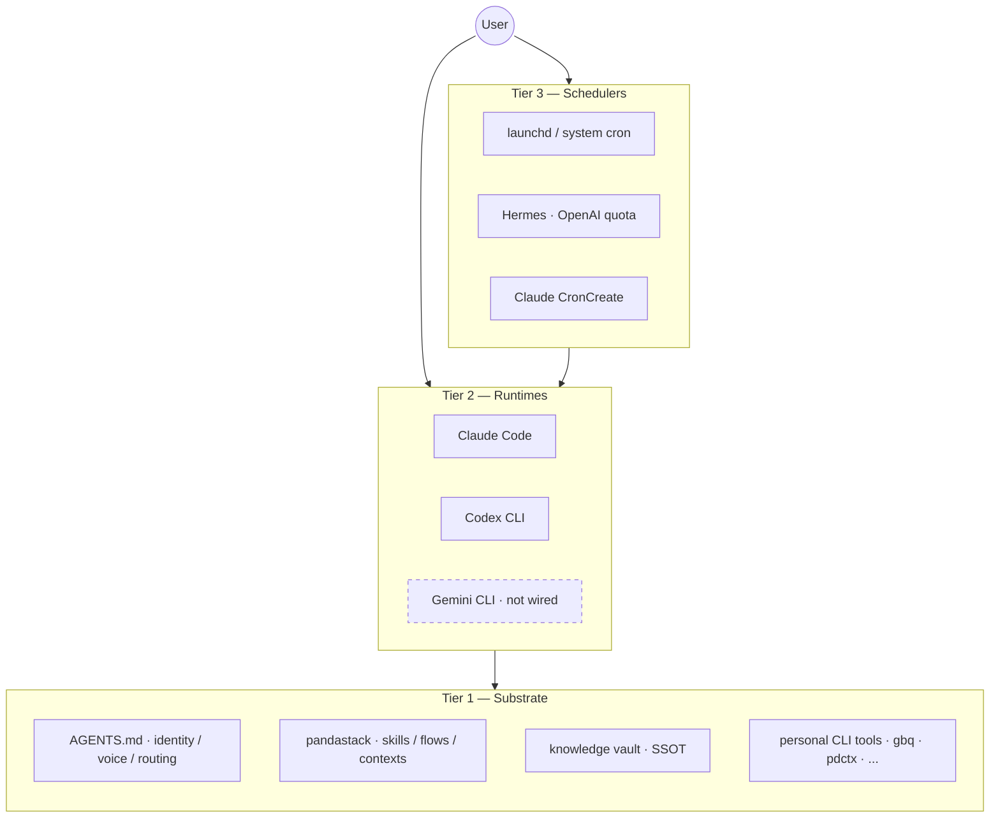

# pandastack

Personal context-aware AI operator OS — one substrate, four runtimes, no vendor lock-in.

I built pandastack to run my own work across multiple AI CLIs without dotdir sprawl. Skills are version-controlled markdown. Personas are replaceable. Context recipes ship as TOML. Same content runs across Claude Code, Codex CLI, Gemini CLI, and Hermes; per-CLI shims handle syntax differences. No data-layer vendor lock-in.

The stack is 39 skills covering dev, knowledge, writing, work, research, retro, and decision lifecycles, anchored on a personal Obsidian vault as SSOT. v1.0.0 stable since 2026-04-29; API and schema stable from this version forward.

**Who this is for:**
- **Multi-CLI users** who want the same skills across Claude Code, Codex CLI, and Hermes
- **Vault-centric operators** building on Obsidian + personal CLIs (gbq, pdctx, gog, bird)
- **Personal-OS builders** who want substrate-first architecture instead of dotdir sprawl

## Quick start

1. `/plugin marketplace add panda850819/pandastack` then `/plugin install pandastack@pandastack` (Claude Code; other hosts in Install)
2. `/pandastack:init` once inside your project
3. Try `/office-hours` — bring a fuzzy idea, walk out with a written brief
4. Try `/sprint` — 1-2h focused execution, ends in SHIPPED / PAUSED / FAILED
5. Try `/knowledge-ship <path>` on a finished note in your vault
6. Stop there. You'll know if pandastack fits how you work.

## How skills connect

`/office-hours` writes a brief. `/sprint` reads the brief and executes. `/sprint` ends in SHIPPED, then `/knowledge-ship` or `/work-ship` reads the session note and runs Close + Extract + Backflow. Each step writes an artifact the next step picks up. You decide when to fire each step; the brief, session note, and decision log are the contracts between phases.

## See it work

```
You:    我想做一個 RSS curation 工具，每天整理 AI 圈新聞，但範圍我沒想清楚
You:    /office-hours

Claude: [load context] gbq RSS / digest / curation — 3 條相關 vault note 帶上來
        [grill] 6 forcing questions: 痛是「資訊過載」還是「漏掉重要的」?
                                     現在怎麼讀? 「重要」誰定義?

You:    痛是漏掉，「重要」標準是會引用到工作上
Claude: [premise challenge] 你說「整理 digest」，但描述的是「curation 系統」.
                            Digest 是 push; curation 是反向過濾.
        [alternatives]
                A. RSS → AI 摘要 → 每日 push
                B. RSS → 看過的舊文 fingerprint → 過濾不相關
                C. RSS → AI ranking → top-N 推送
        [recommendation] 先做 B 的 MVP. A 你已經被 newsletter 餵爆.
        [write brief] docs/briefs/2026-05-05-feed-curator.md

You:    /sprint docs/briefs/2026-05-05-feed-curator.md
Claude: [dojo] 讀 brief, gbq 過往 RSS / curation note
        [grill-lite] 一題: MVP 先做哪 3 個 source?
You:    HN + Lenny + 自己 X 收藏
Claude: [execute] ~400 lines across 4 files. bun test 12/12 passed.
        [review] /review → 1 ASK (fingerprint hash 衝突) → 你 approve fix.
        [terminal] State: SHIPPED. Session note: docs/sessions/2026-05-05-sprint-feed-curator.md

You:    /knowledge-ship docs/sessions/2026-05-05-sprint-feed-curator.md
Claude: [Close]    frontmatter / used_in / wiki-link 補齊
        [Extract]  3 questions:
                   - 最大發現? 「fingerprint 比 keyword 過濾乾淨」
                   - 假設錯在? 「以為 30 條都該讀，其實 5 條夠了」
                   - 下次重來怎麼做? 「先寫 fingerprint test 再寫 source connector」
        [Backflow]
                   principle → docs/learnings/patterns/fingerprint-over-keyword.md
                   SOP → curate-feeds skill 已合併
                   signal → 加進 weekly retro 候選
```

You said "RSS digest tool". The agent reframed it as "curation system" — listening to the pain, not the feature request. Three slash commands, end to end. Brief is the contract between phases.

## Architecture

The **Tier 1 substrate** is runtime-agnostic: identity, voice, skill content, knowledge vault, and personal CLI tools live on disk. All runtimes read the same `AGENTS.md` before acting. No vendor lock-in at the data layer.

The **Tier 2 runtimes** (Claude Code, Codex CLI, Gemini CLI) are thin consumers of Tier 1. Each gets a slim shim in its dotdir (`~/.claude/`, `~/.codex/`, `~/.gemini/`). Skills, flows, and context recipes are identical across runtimes; a per-CLI tool-name mapping handles syntax differences.

The **Tier 3 schedulers** (launchd, Hermes, Claude CronCreate) orchestrate Tier 2. Hermes spawns Codex on OpenAI quota for overnight cron jobs, preserving Claude token budget for foreground work. All three layers share the same Tier 1 substrate — no duplication, no drift.



## Multi-runtime arbitrage

Claude Code (Opus) handles foreground reasoning where depth matters. Codex CLI takes multi-file edits and batch tasks via `pdctx call`, spending OpenAI subscription quota instead of Claude tokens. Hermes schedules overnight Codex jobs against the same Tier 1 substrate. Gemini CLI is in Tier 2 but not yet wired; the planned use case is long-document distill passes requiring 1M-token context.

## Runtime support

pandastack is not a monolithic runtime. It is a stack package: shared skills, flows, personas, context recipes, and conventions that different hosts can consume.

Host design notes live in [`docs/ADDING_A_HOST.md`](docs/ADDING_A_HOST.md).

| Host | Status | Install model |
|---|---|---|
| Claude Code | First-class | Claude plugin marketplace, local repo or GitHub repo |
| Codex CLI | Supported | Native skill discovery via clone + symlink |
| Hermes | Supported as scheduler / host, not as first-class packaged runtime yet | Use `pdctx` for context dispatch, or import/symlink selected skills into `~/.hermes/skills/` |
| OpenClaw | Planned / experimental | Intended shape is a skill package, not shipped as a first-class installer in this repo yet |

## Install

### 1. Claude Code, recommended path

Install from GitHub marketplace source:

```
/plugin marketplace add panda850819/pandastack
/plugin install pandastack@pandastack
/reload-plugins
```

Install from a local cloned repo, useful for dogfood and author testing:

```
/plugin marketplace add /absolute/path/to/pandastack
/plugin install pandastack@pandastack
/reload-plugins
```

After install, run `/pandastack:init` once inside your project.

### 2. Codex CLI

Codex consumes pandastack through native skill discovery, not the Claude plugin manifest.

See [`plugins/pandastack/.codex/INSTALL.md`](plugins/pandastack/.codex/INSTALL.md) for the full clone + symlink flow.

Minimal path:

```bash
git clone https://github.com/panda850819/pandastack.git ~/.codex/pandastack
ln -s ~/.codex/pandastack/plugins/pandastack/skills ~/.codex/skills/pandastack
```

Then restart Codex.

### 3. Hermes

Hermes does not consume the Claude plugin manifest directly. Today there are two valid ways to use pandastack with Hermes.
Detailed guide: [`docs/HERMES.md`](docs/HERMES.md)

#### Option A, recommended: Hermes as scheduler / host, `pdctx` as dispatch layer

This is the setup used in dogfood. Hermes cron or chat triggers a `pdctx call ...`, and `pdctx` injects the right context, persona, and skill subset into the downstream runtime.

```bash
git clone https://github.com/panda850819/pdctx ~/site/cli/pdctx
cd ~/site/cli/pdctx
bun install
bun link
pdctx init
pdctx use personal:developer
```

Example dispatch:

```bash
pdctx call personal:writer "/brief-morning"
```

#### Option B, direct Hermes skill import

If you want Hermes to load the skills directly, symlink or copy selected skill folders from `plugins/pandastack/skills/` into `~/.hermes/skills/` under your preferred category layout.

This repo does not currently ship a first-class Hermes package manifest. The content is portable, but packaging is still manual.

### 4. OpenClaw

OpenClaw support is not shipped here as a first-class installer yet.
Detailed guide: [`docs/OPENCLAW.md`](docs/OPENCLAW.md)

Current intended direction:
- pandastack content stays host-agnostic
- OpenClaw should consume it as a skill package, not via the Claude plugin manifest
- host-specific glue, naming, and runtime contracts should live on the OpenClaw side

If you want to experiment today, use `plugins/pandastack/skills/` as the source of truth and adapt the host-side manifest / loader in your OpenClaw environment. Treat this as experimental, not stable install surface.

## pdctx command cheatsheet

| Command | Outcome |
|---|---|
| `pdctx status` | Shows active context, recent calls, in-flight dispatches |
| `pdctx use personal:writer` | Switches to writer context; injects persona + skill subset |
| `pdctx call personal:developer "summarize today's note"` | Dispatches subagent with full context injected |
| `gbq "<question>"` | Vault hybrid search (requires gbrain) |
| `/brief-morning` | Invokes the morning briefing skill manually (alias `/morning-briefing` valid until 2026-08-04) |

## Local development loop, author workflow

If you are developing pandastack itself, the clean loop is:

1. Clone the repo locally.
2. Point Claude Code marketplace at that local repo.
3. Install `pandastack@pandastack` from the local source.
4. Edit files in the repo.
5. Run `/reload-plugins` in Claude Code to pick up changes.
6. Re-run the target skill / flow.

Example:

```
/plugin marketplace add /absolute/path/to/pandastack
/plugin install pandastack@pandastack
/reload-plugins
```

For Codex, the equivalent loop is `git pull` or local edits on the cloned repo plus a Codex restart. For Hermes direct-import setups, re-copy or re-symlink the changed skill files.

## Contexts

Context recipes live in `plugins/pandastack/contexts/*.toml`. Each recipe binds a flow, persona, skill subset, memory namespace, and gbrain source list to a specific identity.

| Context | Purpose |
|---|---|
| `personal:developer` | Personal dev work — eng persona, dev + knowledge flows |
| `personal:writer` | Personal writing — writing + knowledge flows |
| `personal:knowledge-manager` | Vault maintenance, wiki lint, knowledge lifecycle |
| `personal:trader` | Market research, on-chain analysis, trading flows |
| *(4 work contexts)* | Org-specific roles — defined in a private overlay |

## Skills

39 skills grouped by lifecycle. Persona names follow the gstack convention — each skill is "your specialist" for that step.

### Think / intake

| Skill | Your specialist | What they do |
|---|---|---|
| `/office-hours` | The Interrogator | Bring a fuzzy idea, walk out with a written brief. 5-stage flow: load context, adversarial grill, premise challenge, alternatives, write brief. |
| `/grill` | The Adversary | Atomic 5-10 min adversarial discovery. One question at a time, hunting for hidden requirements and unknown unknowns. |
| `/dojo` | The Sensei | Pre-action context prep. gbq past similar cases, surface gotchas before the work session starts. |

### Plan / decide

| Skill | Your specialist | What they do |
|---|---|---|
| `/architect` | System Architect | Greenfield design. Tech stack, DB schema, service boundaries, ADRs, trade-offs. |
| `/boardroom` | The Boardroom | 4-voice plan critique (CEO → product → design → eng). Per-finding apply gate. |
| `/ceo` | Strategic Advisor | Multi-framework thinking. Kill / pivot / continue judgment. |
| `/product-lead` | VP Product | User problems over solutions. Says no more than yes. |
| `/ops-lead` | COO | Systems that run without you. Process design when there's real pain. |

### Build

| Skill | Your specialist | What they do |
|---|---|---|
| `/sprint` | Sprint Coach | 1-2h focused execution. Internal flow: dojo → grill (lite) → execute → review → ship. Ends in SHIPPED / PAUSED / FAILED. |
| `/execute-plan` | The Executor | Subagent dispatch per approved plan. Verification gate per task. |
| `/team-orchestrate` | The Conductor | N independent branches in parallel git worktrees. |
| `/eng-lead` | Staff Engineer | Build, debug, ship. Minimal diff, root cause, no spiral. |
| `/design-lead` | Senior Designer | Intentional over decorative. Anti-slop, accessibility-first. |
| `/careful` | Safety Gate | Confirmation gates before destructive commands (force push, rm -rf, DROP). |
| `/freeze` | Scope Freezer | Lock edits to specific paths for the session. |

### Review / QA

| Skill | Your specialist | What they do |
|---|---|---|
| `/review` | Code Reviewer | Parallel 3-pass review (correctness, security, architecture) + Codex adversarial cross-check. |
| `/qa` | QA Lead | Browser-based QA. Opens real pages, runs flows, finds bugs. |

### Ship

| Skill | Your specialist | What they do |
|---|---|---|
| `/ship` | Release Engineer | Test, commit, push, open PR. One command from "code done" to "PR open". |

### Close (lifecycle backflow)

| Skill | Your specialist | What they do |
|---|---|---|
| `/knowledge-ship` | Knowledge Closer | Close vault note: Close (verify + used_in) → Extract (3 questions) → Backflow (route principle / SOP / signal). |
| `/write-ship` | Writing Closer | Close a Blog/_daily draft → publish. Close → Extract → Backflow for writing. |
| `/work-ship` | Work Closer | Close a work topic. Vault-only writes; external system updates ship as proposals to Inbox/. |

### Research

| Skill | Your specialist | What they do |
|---|---|---|
| `/deep-research` | The Researcher | Two-layer autonomous: planner finds vault gaps, researcher executes deep exploration. |
| `/scout` | The Scout | Reconnoiter public ecosystem (GitHub, public SKILL.md / AGENTS.md) for harness patterns. |
| `/gatekeeper` | The Gatekeeper | Pre-adoption trust check (skills, MCPs, repos, on-chain addresses). |

### Reflect / hygiene

| Skill | Your specialist | What they do |
|---|---|---|
| `/retro-week` | Weekly Retro | Read prep brief, conduct interview, write final retro. |
| `/retro-month` | Monthly Retro | Strategic monthly review with project memory updates. |
| `/process-decisions` | Decision Processor | Walk through ticked items in cron-reports/, execute each one. |
| `/atomize` | The Atomizer | Distill a learning into atomic principles. AI never writes a claim the user hasn't ratified. |
| `/wiki-lint` | Vault Janitor | Vault hygiene audit. Orphans, duplicates, stale, dead redirects. |
| `/inbox-triage` | Inbox Triage | Weekly Inbox/ hygiene. Bucket stale .md by category. |
| `/curate-feeds` | Feed Fetcher | Fetch raw feed items to Inbox/feeds/raw/ with dedupe and noise filter. |

### Session

| Skill | Your specialist | What they do |
|---|---|---|
| `/init` | The Initializer | One-time pandastack init per project. Detects project type, writes config to CLAUDE.md. |
| `/done` | Session Closer | Save context, summarize work, persist memory at session end. |
| `/checkpoint` | The Bookmarker | Save / resume working state snapshots. |

Tool wrappers (`tool-bird`, `tool-slack`, `tool-notion`, `tool-railway`, `tool-pdf`, `tool-summarize`, `tool-browser`, `tool-deepwiki`) and thinking lenses (`think-like-naval`, `think-like-karpathy`, `think-like-alan-chan`) round out the 39 — see [`docs/skills.md`](docs/skills.md) for the full list.

## Personas

5 replaceable personas in `plugins/pandastack/agents/`. Replace any persona file; all skills referencing it pick up the change after `/reload-plugins`.

| Persona | Role |
|---|---|
| `eng` | Staff engineer — build, review, debug, ship |
| `design` | Senior designer — UI/UX, accessibility, anti-slop |
| `ceo` | Strategic advisor — scope decisions, kill/pivot |
| `ops` | COO — systems that run without you, process design |
| `product` | VP Product — requirements, scope, metrics |

## Lifecycle Flows

7 flow specs in `plugins/pandastack/flows/` define the phase progression each lifecycle follows:

| Flow | Lifecycle |
|---|---|
| `dev` | brief → build → review → qa → ship → extract |
| `knowledge` | capture → distill → verify → ship → lint |
| `writing` | capture → structure → draft → ship → distribute |
| `work` | triage → context → execute → ship → push (vault-only) |
| `research` | scope → fetch → dive → distill → ship |
| `retro` | daily / weekly / monthly cadence with auto-scan |
| `decision` | cron-driven decision triage |

## Telemetry opt-out

pandastack appends one JSON event per action to a daily JSONL timeline:

```
~/.pdctx/audit/timeline-YYYY-MM-DD.jsonl
```

Events: `session_start`, `skill_invoke`, `tool_use`, `firewall_decision`, `session_end`. No prompt content, tool arguments, or file contents are logged.

```bash
export PDCTX_TIMELINE_DISABLED=1   # disable the timeline entirely
export PDCTX_L5_DISABLED=1         # disable L5 firewall only (timeline stays on)
```

See [`docs/telemetry.md`](docs/telemetry.md) for the schema and sample analysis queries.

## Layer model (firewall)

Five active layers between context declaration and tool execution:

| Layer | Mechanism |
|---|---|
| L1 | Prompt-level persona / voice / banned phrases |
| L2 | Filesystem chmod on memory namespace per context |
| L3 | MCP deny list enforced at PreToolUse |
| L4 | Context recipe loaded via `pdctx use` |
| L5 | Per-skill allowlist on tool args and file paths |

L5 reads `reads`, `writes`, `forbids`, and `classification` from each SKILL.md's frontmatter. Skills without frontmatter metadata are treated as permissive with a warning. See [`docs/firewall-l5.md`](docs/firewall-l5.md) for the decision tree, sample deny output, and known gaps.

## Hermes jobs (current)

| Job | Schedule | Skill |
|---|---|---|
| Morning Briefing | `0 8 * * *` (daily 8 AM) | `/brief-morning` (was: `/morning-briefing`) |
| Evening Distill | `0 22 * * *` (daily 10 PM) | `/evening-distill` |
| Weekly Retro Prep | `0 9 * * 5` (Fri 9 AM) | `/retro-prep-week` (was: `/weekly-retro-prep`) |

## Updating

### For users

#### Claude Code, installed from GitHub marketplace source

```bash
/plugin marketplace update pandastack
/plugin update pandastack@pandastack
/reload-plugins
```

#### Claude Code, installed from local repo

Pull the repo or edit it locally, then reload:

```bash
cd /absolute/path/to/pandastack
git pull
```

Then run `/reload-plugins` in Claude Code.

#### Codex CLI

```bash
cd ~/.codex/pandastack
git pull
```

Restart Codex. The symlinked skills update with the repo.

#### Hermes

If you use Hermes through `pdctx`, update `pdctx` and `pandastack`, then re-run the target dispatch. If you use direct copied or symlinked skills, re-copy or re-symlink the changed skill folders.

### For the author / maintainer

Recommended release loop:

1. Update skill / flow / context content in the repo.
2. Update user-facing docs, especially `README.md` and install notes.
3. Bump visible version markers when behavior changed:
   - `CHANGELOG.md`
   - `plugins/pandastack/.claude-plugin/plugin.json`
   - `plugins/pandastack/.codex-plugin/plugin.json`
   - `.claude-plugin/marketplace.json`, if marketplace metadata changed
4. Verify in the real hosts you claim to support:
   - Claude Code local marketplace install
   - Codex clone + symlink install
   - Hermes `pdctx` dispatch path, if relevant to the change
5. Push the branch, open a PR, merge, then tell users which update path to run.

## Contributing

### Before opening a PR

- Keep skill content in `plugins/pandastack/skills/<name>/SKILL.md`
- Keep each skill concise; the current discipline is roughly under 80 lines unless the extra length clearly earns itself
- Run validation before opening a PR:

```bash
pdctx skill-validate
```

Frontmatter fields `reads`, `writes`, `forbids`, `domain`, and `classification` are optional but recommended for L5 coverage. See [SKILL-FRONTMATTER.md](SKILL-FRONTMATTER.md) for the schema.

### How to open a PR

1. Fork the repo or create a branch from `main`.
2. Make the smallest coherent change.
3. Update docs if install surface, runtime behavior, or invocation changes.
4. Add or update CHANGELOG entries when the change is user-visible.
5. Open a PR describing:
   - what changed
   - which host it affects, Claude Code / Codex / Hermes / OpenClaw
   - how you tested it
   - any migration or reload step users need

Repository PRs: [github.com/panda850819/pandastack/pulls](https://github.com/panda850819/pandastack/pulls)

### How to file an issue

Please include:
- host/runtime, Claude Code / Codex / Hermes / OpenClaw
- install model, GitHub marketplace / local marketplace / clone + symlink / manual import
- expected behavior
- actual behavior
- reproduction steps
- relevant logs or screenshots

Repository issues: [github.com/panda850819/pandastack/issues](https://github.com/panda850819/pandastack/issues)

## License

MIT

## Acknowledgements

README structure (Quick start, Who this is for, See it work, Skill / specialist / what they do tables) inspired by [gstack](https://github.com/garrytan/gstack). The JSONL session timeline pattern is also borrowed from gstack and iterated for per-context isolation.
