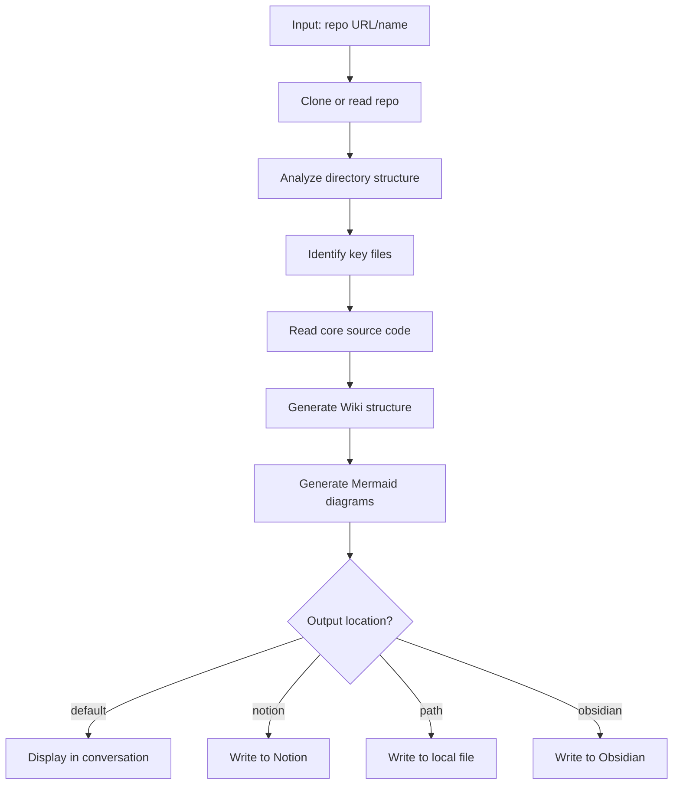
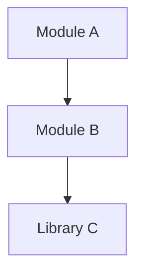
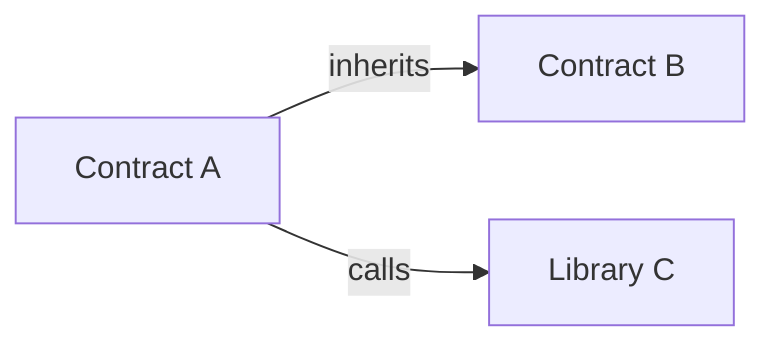
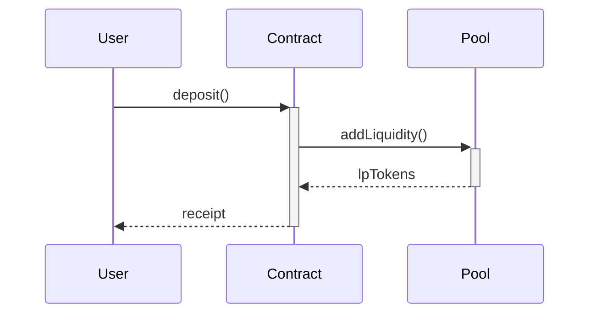

# DeepWiki Skill

Analyze GitHub repos and generate structured documentation with Mermaid architecture diagrams.

## Syntax

```
/deepwiki <repo-url-or-name> [--output <location>]
```

## Parameters

| Parameter | Description | Example |
|-----------|-------------|---------|
| `repo` | GitHub repo URL or `org/name` format | `<org>/<repo>` |
| `--output` | Output location (optional) | `notion`, `obsidian`, `./path` |

## Output Options

| Option | Description |
|--------|-------------|
| (default) | Display directly in conversation |
| `--output notion` | Write to Notion (will ask for page ID) |
| `--output obsidian` | Write to `knowledge/repos/<repo>.md` |
| `--output <path>` | Write to specified path |

## Examples

```bash
# Default: display in conversation
/deepwiki <org>/<repo>

# Output to Notion
/deepwiki <org>/<repo> --output notion

# Output to local file
/deepwiki <org>/<repo> --output ./docs/<repo>.md

# Output to Obsidian
/deepwiki <org>/<repo> --output obsidian
```

---

## Workflow



---

## Phase 1: Repo Analysis

### 1.1 Clone Repository

```bash
# Verify GitHub account — abort early if not authenticated
gh auth status || { echo "ERROR: gh not authenticated. Run 'gh auth login' first."; exit 1; }

# Clone to temp directory (shallow clone to minimize download)
REPO_DIR="/tmp/deepwiki/<repo-name>"
if [ -d "$REPO_DIR" ]; then
  cd "$REPO_DIR" && git pull
else
  gh repo clone <repo> "$REPO_DIR" -- --depth 1
fi

# If clone fails (repo doesn't exist, private, network error):
# → Report the error clearly to the user and stop
# → Do NOT attempt to generate documentation without source code
```

### 1.2 Analyze Directory Structure

```bash
# Exclude common non-source directories
tree -L 3 -I 'node_modules|.git|dist|build|coverage|__pycache__|.next|target'
```

### 1.3 Identify Tech Stack

| File | Tech Stack |
|------|------------|
| `package.json` | Node.js/TypeScript |
| `Cargo.toml` | Rust |
| `requirements.txt` / `pyproject.toml` | Python |
| `hardhat.config.js` / `hardhat.config.ts` | Solidity + Hardhat |
| `foundry.toml` | Solidity + Foundry |
| `Move.toml` | Move |
| `go.mod` | Go |

**Fallback**: If no recognized config file exists, infer tech stack from file extensions (`.py`, `.rs`, `.go`, `.ts`, `.sol`) and directory conventions. State "inferred from file extensions" in the output.

### 1.4 Identify Key Files

Priority reading order:
1. `README.md` - Existing documentation
2. `package.json` / `Cargo.toml` etc. - Dependencies and scripts
3. `src/index.ts` / `src/lib.rs` / `src/main.py` - Entry points
4. `contracts/*.sol` - Smart contracts
5. `test/` - Test files (understand functionality)

### 1.5 Handle Minimal or Empty Repos

After reading key files, assess whether there is enough source code to generate meaningful documentation:

- **No source files at all** (only README, LICENSE, config): Inform the user that the repo has no analyzable source code. Output a minimal report with just the README summary, repo metadata, and a note that no architecture or module docs could be generated.
- **Very small repo** (< 5 source files): Produce documentation but skip the "Core Modules" section if there aren't distinct modules. Focus on file-by-file description instead.
- **Monorepo with many packages**: Identify the top-level packages first (`packages/`, `apps/`, `crates/`). Always generate a high-level overview with per-package summaries first. Then ask the user if they want a deep dive into a specific package. Do not block on user input — deliver the overview immediately.

**Do NOT hallucinate modules, APIs, or architecture for repos that lack sufficient source code.**

---

## Phase 2: Documentation Generation

### Mandatory Output Requirements

Every deepwiki output MUST include ALL of the following sections. Missing any section is a failure.

| # | Section | Requirement | Fail if missing |
|---|---------|-------------|-----------------|
| 1 | **Tech Stack** | List framework, language, key dependencies from config files | Yes |
| 2 | **Architecture Diagram** | At least one syntactically valid Mermaid `graph` diagram showing module/component relationships. Validate: unique node IDs, correct arrow syntax (`-->`, `-->\|label\|`), no unclosed brackets. | Yes |
| 3 | **Directory Structure** | Table with `\| Directory \| Purpose \|` columns, derived from actual `tree` output — never invented | Yes |
| 4 | **Core Modules** | Each module references concrete functions/classes/APIs found in source code | Yes |
| 5 | **Quick Start** | Install + run commands matching the project's actual package manager and scripts from config files | Yes |

### Source Reading Rule

You MUST read at least 2 actual source files (entry points like `src/index.ts`, `src/lib.rs`, `src/main.py`, `contracts/*.sol`, `app/page.tsx`, etc.) — not just README and config files. Module descriptions and architecture diagrams must be grounded in source code you actually read, not inferred from file names alone.

### Output Routing Rule

When `--output` is specified, you MUST route the final document accordingly:
- `--output notion` → write via `notion page update` (ask user for page ID first)
- `--output obsidian` → write to `knowledge/repos/<repo-name>.md`
- `--output <path>` → write to the exact path specified
- (no flag) → display directly in conversation

Never ignore the `--output` flag. Never default to conversation display when a flag is present.

### Output Structure

```markdown
# <Repo Name>

> One-line description

## Tech Stack

- Framework: ...
- Language: ...
- Dependencies: ...

## Architecture Diagram


## Directory Structure

| Directory | Purpose |
|-----------|---------|
| src/ | ... |
| test/ | ... |

## Core Modules

### Module A
- Functionality: ...
- Key APIs: ...

### Module B
- ...

## Quick Start

```bash
# Install
pnpm install

# Run
pnpm dev
```

## Related Resources

- [Original README](...)
- [Notion Docs](...)
```

---

## Phase 3: Mermaid Generation

Generate appropriate diagrams based on project type:

### Module Relationship Diagram (all projects)



### Smart Contract Relationship Diagram (Solidity projects)



### Data Flow Diagram (if applicable)



---

## Phase 4: Output

### 4.1 Default (display in conversation)

Directly output the generated markdown content.

### 4.2 Notion Output

```bash
# Ask user for page ID
# Write to temp file
echo "$CONTENT" > /tmp/deepwiki/output.md

# Update page using notion-cli
notion page update <page-id> --file /tmp/deepwiki/output.md
```

### 4.3 Local File Output

Use Write tool to write to specified path.

### 4.4 Obsidian Output

Write to `knowledge/repos/<repo-name>.md`.

---

## Phase 5: Quality Gate (mandatory before output)

Run these checks before delivering output. **You MUST produce the checklist below (pass/fail per item) in your thinking before outputting the final document.** If any item fails, fix and re-check before delivery.

1. **Mermaid syntax**: Re-read each diagram block. Verify node IDs are unique, arrows use correct syntax (`-->`, `-->|label|`, `->>+`), and no unclosed brackets. If `mmdc` is available, run `echo "$DIAGRAM" | npx -y @mermaid-js/mermaid-cli mmdc -i - -o /dev/null` to validate.
2. **Directory structure accuracy**: Cross-check table against actual `tree` output — no invented directories.
3. **Tech stack correctness**: Confirm listed frameworks match what config files actually declare.
4. **Core modules completeness**: Each listed module must reference at least one concrete function/class/API from the source code read. If a module can't be substantiated, remove it.
5. **Quick start executability**: Verify commands match the project's actual package manager (`npm`, `pnpm`, `yarn`, `cargo`, `pip`, etc.) and scripts defined in config files.

---

## Integrations

- **GitHub CLI** (`gh`): Clone repos
- **Notion CLI** (`notion`): Write to Notion
- **Write tool**: Write to local/Obsidian

## Verification

Covered by Phase 5 Quality Gate above. Additionally verify:
1. Output links (README, docs) point to valid URLs
2. Cleanup: `rm -rf /tmp/deepwiki/<repo-name>` after output is delivered

## Handoff

After completion, inform user of:
- Generated documentation location
- How to view/edit
- Follow-up suggestions (if needed)
